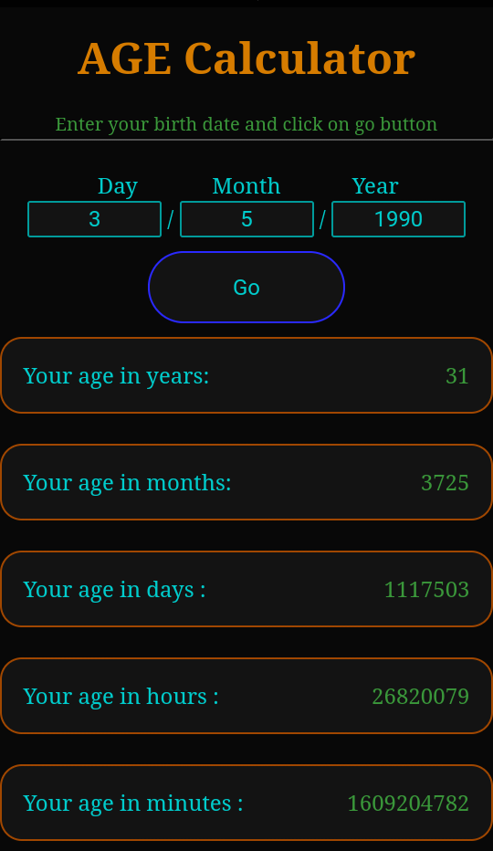

# Age-calculator
<h2> this calculator can calculate your in</h2>
<ul>
  <li>years</li>
  <li>months</li>
  <li>days</li>
  <li>hours</li>
  <li>minutes</li>
  <li>seconds</li>
  </ul>
<h1 style="color:lightgreen">Screenshot</h1>

